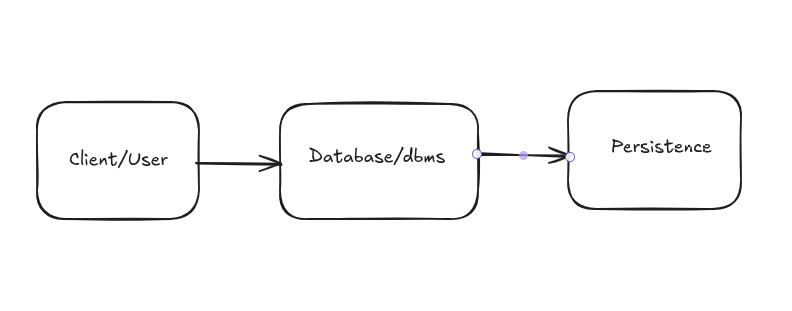

### Simple Relational database manager
#### Core architecture
1. Store engine-Data is physically saved
2. Data structure - How data is organized
3. Sql parser - Translates String like `select` into instructions.
4. Execution engine - The logic that actually filters, join and sort the data.

#### Design 



#### How it works
User creates table with the prefer columns that carries defined data type as shown below;
```java
TableSchema schema = new TableSchema(
                "users",
                List.of(
                        new ColumnDef("id", ColumnType.INT),
                        new ColumnDef("firstname", ColumnType.STRING),
                        new ColumnDef("lastname", ColumnType.STRING),
                        new ColumnDef("email", ColumnType.STRING)
                ),
                0
        );
```
This will create a file called users with the defined column. This file is then created locally for persistence. Basically this says create a .csv file called users with the columns defined. 
After this is done, we can the add data to our table as shown.

```java
    TableFile userTable = new TableFile(schema);
    userTable.insert(new RowLayout(schema, 1, "Paul", "HH", "abc@gmail.com"));
    userTable.insert(new RowLayoutWithType(schema, 2, "Jame", "Ambole", "abc@gmail.com"));
    userTable.insert(new RowLayoutWithType(schema, 3, "Uhuu", "Kesia", "abc@gmail.com"));
    userTable.insert(new RowLayoutWithType(schema, 4, "Paul", "Juma", "abc@gmail.com"));
```
This data is then serialized since data is stored in binary format in the database.
During retrieval, the data is deserialized.

#### Work flow
```sql
# Step 1: Create database
shell:> create-database mydb

# Step 2: Use database
shell:> use mydb

# Step 3: Create table
shell:> create-table users id:INT firstname:STRING lastname:STRING email:STRING

# Step 4: Insert data
shell:> sql "INSERT INTO users VALUES (1, 'John', 'Doe', 'john@example.com')"

# Step 5: Query data
shell:> sql "SELECT * FROM users"
```

#### Command flow
SQL Command
    |
SQL interface
    |
Table factory
    |
Table file

#### Reference
Medium
Stackoverflow
Chatgpt